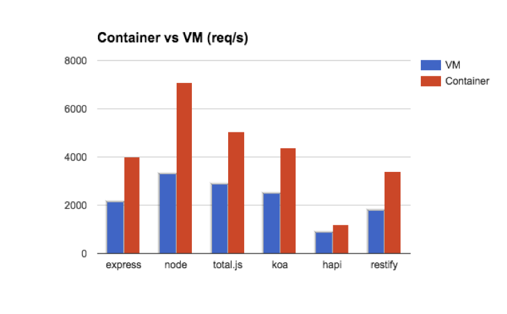

# Node.js Framework Performances Compared Container vs VM

## Test Setup

* CentOS 7
* Node.js v6.7.0
* 2GB RAM & 1 CPU in the same datacenter
* Linux VM vs Linux Container on Metal

## Results

* y-axis = req/s  (higher is better)

### CentOS 7 in Container

*express*
Requests per second:    4000.75 [#/sec] (mean)

*hapi*
Requests per second:    1183.04 [#/sec] (mean)

*node*
Requests per second:    7071.19 [#/sec] (mean)

*restify*
Requests per second:    3406.93 [#/sec] (mean)

*koa*
Requests per second:    4388.11 [#/sec] (mean)

*total.js*
Requests per second:    5068.96 [#/sec] (mean)

### CentOS 7 in VM

*express*
Requests per second:    2128.04 [#/sec] (mean)

*hapi*
Requests per second:    878.45 [#/sec] (mean)

*node*
Requests per second:    3305.18 [#/sec] (mean)

*restify*
Requests per second:    1785.11 [#/sec] (mean)

*koa*
Requests per second:    2504.24 [#/sec] (mean)

*total.js*
Requests per second:    2890.36 [#/sec] (mean)
